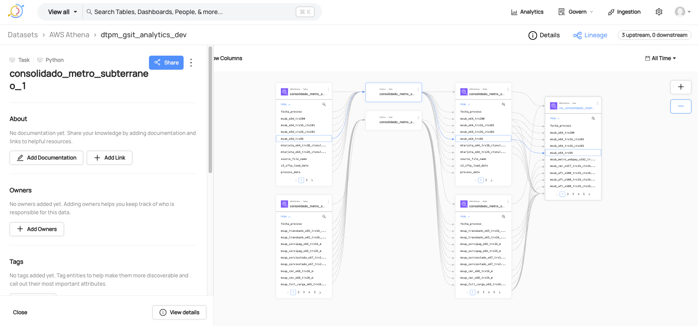
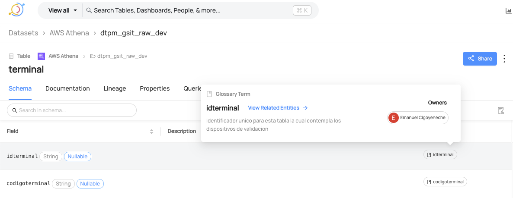

# 🧠 DataHub Toolkit: Automatic Lineage and Glossary


[](README.md)
[](README-en.md)

This repository contains tools to automate:

- 🔁 The creation of column lineage between tables (OpenLineage + DataHub)
- 📚 The creation of glossary terms and their automatic association with columns

---


## 📚 Table of Contents

- [DataHub Lineage Local Runner](#datahub-lineage-local-runner)
- [DataHub Glossary Local Runner - Column Associations](#datahub-glossary-local-runner---column-associations)


# DataHub Lineage Local Runner

This repository enables **emitting column lineage between tables** locally using [`openlineage-python`](https://github.com/OpenLineage/OpenLineage) and DataHub, integrating a CSV file with the relationships.

---




## 📌 Objective

Create lineage events between source and destination datasets defined in a CSV file, and send them to the publicly exposed DataHub backend (GMS).

---

## 📁 Project Structure
```bash
├── create_lineage_local.py # Main script to emit lineage
├── config.json # DataHub connection configuration
├── datos.csv # CSV file with lineage columns
├── README.md # Documentation
```
### 📝 Additional Note

The repository includes example files that serve as templates to configure your work environment without compromising sensitive information.

`datos_example.csv` defines the expected format for the `datos.csv` file, which has been excluded from version control via `.gitignore`. You can use this example file as a base to create your own `datos.csv`, ensuring you respect the established columns and structure.

Similarly, `config_example.json` acts as a reference to build your `config.json` file, also ignored by Git. From this file, you can generate your own custom configuration while maintaining the necessary keys and structure.

---

## 📋 Requirements

- Python >= 3.9 (recommended to use Anaconda)
- DataHub account with exposed GMS
- Authentication token (DataHub API Key)

---

## 📦 Installation

### 1. Create and activate virtual environment (using Anaconda)

```bash
conda create -n lineage-env python=3.10 -y
conda activate lineage-env
```


### 2. Install dependencies
```bash
pip install openlineage-python pandas
```


You can also install directly using conda create:
```bash
conda install --file conda-lineage-requirements.txt
```

### 3. Configuration
Edit the `config.json` file with:

api_url: Public URL of your DataHub instance (without /api/gms)

api_endpoint: usually openapi/openlineage/

access_token: your DataHub API Token

linage_csv_s3_paths: list of CSV files with lineage definitions

```bash
{
  "api_url": "http://<your-datahub-url>",
  "api_endpoint": "openapi/openlineage/",
  "access_token": "<your_token>",
  "linage_csv_s3_paths": [
    {
      "name": "lineage-local-test",
      "path": "datos.csv"
    }
  ]
}
```
### 4. CSV Structure (datos.csv)
| Field                      | Type | Description                                       |
| -------------------------- | ---- | ------------------------------------------------- |
| job_name                   | str  | Name of the job generating lineage for the relationship |
| id                         | int  | Sequential ID                                    |
| input\_table\_source       | str  | Source (namespace), e.g., `athena`, `glue`       |
| input\_table               | str  | Full name of the input table                     |
| input\_column              | str  | Source column                                    |
| input\_column\_data\_type  | str  | Data type                                        |
| input\_add\_schema         | bool | `True` if schema of the input should be included |
| output\_table\_destination | str  | Destination (namespace)                          |
| output\_table              | str  | Full name of the destination table               |
| output\_column             | str  | Destination column                               |
| output\_column\_data\_type | str  | Data type                                        |
| output\_add\_schema        | bool | `True` if schema of the output should be included|
| transformation             | bool | `True` if there is a transformation in the column|

### 5. Execution
Once the environment is configured, run:

```bash
python create_lineage_local.py
```
If everything is correct, you will see:
```bash
✅ Lineage emitted for job lineage-local-test
```
You can then visualize the lineage in your DataHub console:
Browse → Lineage → dtpm_gsit_staging_dev.abt_transaccion

### 6. Example Input (datos.csv)
```
job_name,id,input_table_source,input_table,input_column,input_column_data_type,input_add_schema,output_table_destination,output_table,output_column,output_column_data_type,output_add_schema,transformation
site,1,athena,dtpm_gsit_raw_dev.site,idsite,string,False,athena,dtpm_gsit_staging_dev.site,id_site,bigint,False,False
```

---


# DataHub Glossary Local Runner - Column Associations

This module allows creating glossary terms and automatically associating them with specific columns of a dataset in DataHub, using editableSchemaMetadata.

---



## 📌 Objective

Create glossary terms, assign owners to them, and correctly associate them with specific table columns so they appear as Matched column term in the DataHub UI.

---

## 📁 Project Structure
```bash
├── create_glossary_for_column.py   # Main script to create terms and associate them with columns
├── glossary_terms.json             # JSON with the definition of each term, table, field, and metadata
├── config.json                     # DataHub GMS server connection configuration
├── README_glossary.md              # This documentation file

```

---

## 📋 Requirements

- Python >= 3.9 (recommended to use Anaconda)
- DataHub account with exposed GMS
- Authentication token (DataHub API Key)

---

## 📦 Installation

### 1. Create and activate virtual environment (using Anaconda)

```bash
conda create -n glossary-env python=3.10 -y
conda activate glossary-env
```


### 2. Install dependencies
```bash
pip install acryl-datahub pandas
```


Or using Conda directly:
```bash
conda install --file conda-glossary-requirements.txt
```

### 3. Configuration
config.json

This file contains the configuration of your DataHub instance:

```bash
{
  "api_url": "http://<your-datahub-url>",
  "access_token": "<your_token>"
}
```
⚠️ Important: The `api_url` field should not include `/api/gms`.


### 4. 📝 Structure of glossary_terms.json file

```bash
[
  {
    "term": "transaction_date_abt_transaction",
    "description": "Date and time the transaction was recorded.",
    "field": "transaction_date",
    "database": "dtpm_gsit_raw_dev",
    "table": "abt_transaction",
    "platform": "athena",
    "env": "PROD"
  },
  {
    "term": "address_abt_transaction",
    "description": "Recorded location of the buyer at the time of the transaction.",
    "field": "address",
    "database": "dtpm_gsit_raw_dev",
    "table": "abt_transaction",
    "platform": "athena",
    "env": "PROD"
  }
]
```
✅ Tip: Ensure the "term" field relates to the column name ("field"), e.g., if you have a column named "description," there may be multiple columns with this name across different tables. Therefore, use `term: address_abt_transaction` (table name)_(column name) to display it as Matches column term in the DataHub UI and avoid name conflicts.

### 5. Execution
Once the environment is configured, run:

```bash
python create_glossary_for_column.py
```
You should see something like:
```bash
✅ Term created or updated: transaction_date
👤 Owner assigned to term: transaction_date
🧩 Associated 'transaction_date' with the column transaction_date using editableSchemaMetadata
```

### 6. Expected Result
The term will appear in the Glossary module in DataHub.

The term will be displayed in the dataset under the associated column.

In the term view → Related Entities, you will see the dataset and column with the badge Matches column term.

🧠 Important Considerations

The editableSchemaMetadata field applies at the dataset level, so all associations are grouped by table.

If you run the script multiple times, terms will not be duplicated (uses UPSERT).

You can complement with association to datasetField for greater control if you need to mix manual and programmatic metadata.

## Useful Links

Below are some useful and reference links related to DataHub:

- [Tutorials on terms in the DataHub API](https://docs.datahub.com/docs/api/tutorials/terms/)
- [Documentation of DataHub APIs](https://docs.datahub.com/docs/api/datahub-apis)