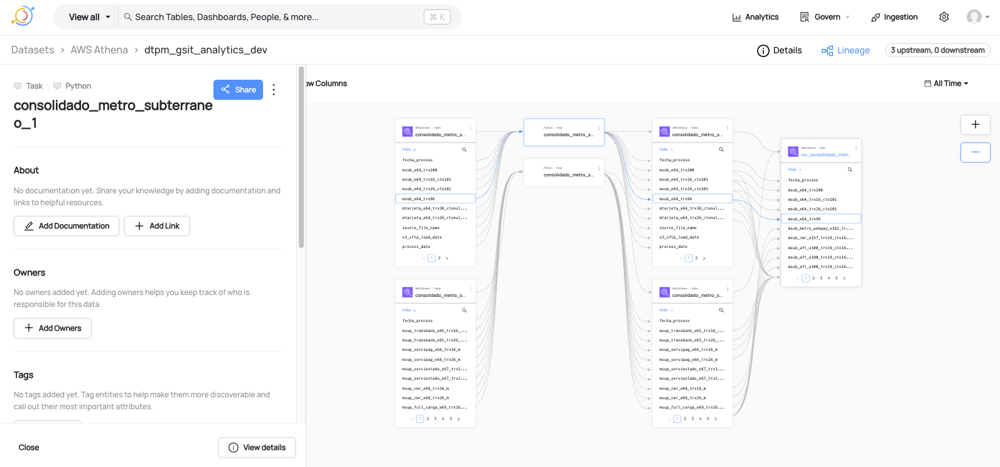
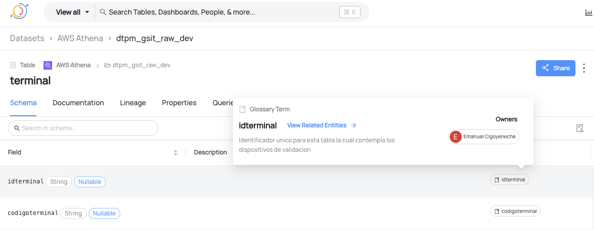

# 🧠 DataHub Toolkit: Lineage y Glosario Automático


[](README.md)
[](README-en.md)

Este repositorio contiene herramientas para automatizar:

- 🔁 La creación de linaje de columnas entre tablas (OpenLineage + DataHub)
- 📚 La creación de términos de glosario y su asociación automática a columnas

---


## 📚 Tabla de Contenido

- [DataHub Lineage Local Runner](#datahub-lineage-local-runner)
- [DataHub Glossary Local Runner - Asociaciones a Columnas](#datahub-glossary-local-runner---asociaciones-a-columnas)


# DataHub Lineage Local Runner

Este repositorio permite **emitir linaje de columnas entre tablas** de forma local usando [`openlineage-python`](https://github.com/OpenLineage/OpenLineage) y DataHub, integrando un archivo CSV con las relaciones.

---




## 📌 Objetivo

Crear eventos de linaje entre datasets de origen y destino definidos en un archivo CSV, y enviarlos al backend de DataHub (GMS) expuesto públicamente.

---

## 📁 Estructura del proyecto
```bash
├── create_lineage_local.py # Script principal que emite linaje
├── config.json # Configuración de conexión con DataHub
├── datos.csv # Archivo CSV con las columnas de linaje
├── README.md # Documentación
```
### 📝 Nota Adicional

El repositorio incluye archivos de ejemplo que sirven como plantilla para configurar tu entorno de trabajo sin comprometer información sensible.

datos_example.csv define el formato esperado para el archivo `datos.csv`, el cual ha sido excluido del control de versiones mediante `.gitignore`. Puedes utilizar este archivo de ejemplo como base para crear tu propio `datos.csv`, asegurándote de respetar las columnas y estructura establecidas.

De igual manera,`config_example.json` actúa como referencia para construir tu archivo `config.json`, también ignorado por Git. A partir de este archivo puedes generar tu propia configuración personalizada, manteniendo las claves y estructura necesarias.

---

## 📋 Requisitos

- Python >= 3.9 (recomendado usar Anaconda)
- Cuenta en DataHub con GMS expuesto
- Token de autenticación (API Key de DataHub)

---

## 📦 Instalación

### 1. Crear y activar ambiente virtual (con Anaconda)

```bash
conda create -n lineage-env python=3.10 -y
conda activate lineage-env
```


### 2. Instalar dependencias
```bash
pip install openlineage-python pandas
```


Tambien se puede instalar usando directamente conda create:
```bash
conda install --file conda-lineage-requirements.txt
```

### 3. Configuración
Edita el archivo config.json con:

api_url: URL pública de tu instancia de DataHub (sin /api/gms)

api_endpoint: normalmente openapi/openlineage/

access_token: tu API Token de DataHub

linage_csv_s3_paths: lista de archivos CSV con definiciones de linaje

```bash
{
  "api_url": "http://<tu-url-datahub>",
  "api_endpoint": "openapi/openlineage/",
  "access_token": "<tu_token>",
  "linage_csv_s3_paths": [
    {
      "name": "lineage-local-test",
      "path": "datos.csv"
    }
  ]
}
```
### 4. Estructura del CSV (datos.csv)
| Campo                      | Tipo | Descripción                                       |
| -------------------------- | ---- | ------------------------------------------------- |
| job_name                   | str  | Nombre del job que genera el linaje para la relación |
| id                         | int  | ID secuencial                                     |
| input\_table\_source       | str  | Fuente (namespace), por ejemplo: `athena`, `glue` |
| input\_table               | str  | Nombre completo tabla de entrada                  |
| input\_column              | str  | Columna origen                                    |
| input\_column\_data\_type  | str  | Tipo de dato                                      |
| input\_add\_schema         | bool | `True` si se desea incluir esquema del input      |
| output\_table\_destination | str  | Destino (namespace)                               |
| output\_table              | str  | Nombre completo tabla destino                     |
| output\_column             | str  | Columna destino                                   |
| output\_column\_data\_type | str  | Tipo de dato                                      |
| output\_add\_schema        | bool | `True` si se desea incluir esquema del output     |
| transformation             | bool | `True` si hay transformación en la columna        |

### 5. Ejecución
Una vez configurado el entorno, ejecuta:

```bash
python create_lineage_local.py
```
Si todo está bien, verás:
```bash
✅ Lineage emitted for job lineage-local-test
```
Luego podrás visualizar el linaje en tu consola de DataHub:
Browse → Lineage → dtpm_gsit_staging_dev.abt_transaccion

### 6. Ejemplo de entrada (datos.csv)
```
job_name,id,input_table_source,input_table,input_column,input_column_data_type,input_add_schema,output_table_destination,output_table,output_column,output_column_data_type,output_add_schema,transformation
sitio,1,athena,dtpm_gsit_raw_dev.sitio,idsitio,string,False,athena,dtpm_gsit_staging_dev.sitio,id_sitio,bigint,False,False
```

---


# DataHub Glossary Local Runner - Asociaciones a Columnas

Este módulo permite crear términos de glosario y asociarlos automáticamente a columnas específicas de un dataset en DataHub, utilizando editableSchemaMetadata.

---



## 📌 Objetivo

Crear términos de glosario, asignarles owners, y asociarlos correctamente a columnas específicas de tablas, de modo que aparezcan como Matched column term en la UI de DataHub.

---

## 📁 Estructura del proyecto
```bash
├── create_glossary_for_column.py   # Script principal para crear términos y asociarlos a columnas
├── glossary_terms.json             # JSON con la definición de cada término, tabla, campo y metadata
├── config.json                     # Configuración de conexión al servidor GMS de DataHub
├── README_glossary.md              # Este archivo de documentación

```

---

## 📋 Requisitos

- Python >= 3.9 (recomendado usar Anaconda)
- Cuenta en DataHub con GMS expuesto
- Token de autenticación (API Key de DataHub)

---

## 📦 Instalación

### 1. Crear y activar ambiente virtual (con Anaconda)

```bash
conda create -n glossary-env python=3.10 -y
conda activate glossary-env
```


### 2. Instalar dependencias
```bash
pip install acryl-datahub pandas
```


O usando Conda directamente:
```bash
conda install --file conda-glossary-requirements.txt
```

### 3. Configuración
config.json

Este archivo contiene la configuración de tu instancia de DataHub:

```bash
{
  "api_url": "http://<tu-url-datahub>",
  "access_token": "<tu_token>"
}
```
⚠️ Importante: El campo api_url no debe incluir /api/gms.


### 4. 📝 Estructura del archivo glossary_terms.json

```bash
[
  {
    "term": "fecha_trx_abt_transaccion",
    "description": "Fecha y hora en que se registró la transacción.",
    "field": "fecha_trx",
    "database": "dtpm_gsit_raw_dev",
    "table": "abt_transaccion",
    "platform": "athena",
    "env": "PROD"
  },
  {
    "term": "direccion_abt_transaccion",
    "description": "Ubicación registrada del comprador al momento de la transacción.",
    "field": "direccion",
    "database": "dtpm_gsit_raw_dev",
    "table": "abt_transaccion",
    "platform": "athena",
    "env": "PROD"
  }
]
```
✅ Consejo: Asegúrate de que el campo "term" tenga relación con el nombre de la columna ("field") , es decir si tienes una columna llamada descripción, pueden existir varia columnas llamadas asi en multiples tablas, por lo tanto seria tener term: direccion_abt_transaccion (nombre de la tabla)_(nombre de la columna) si deseas que se vea como Matches column term en la UI de DataHub, y evitar conflictos de nombres.

### 5. Ejecución
Una vez configurado el entorno, ejecuta:

```bash
python create_glossary_for_column.py
```
Deberías ver algo como:
```bash
✅ Término creado o actualizado: fecha_trx
👤 Owner asignado al término: fecha_trx
🧩 Asociado 'fecha_trx' a la columna fecha_trx mediante editableSchemaMetadata
```

### 6. Resultado esperado
El término aparecerá en el módulo de Glossary en DataHub.

El término se mostrará en el dataset bajo la columna asociada.

En la vista del término → Related Entities, verás el dataset y la columna con el badge Matches column term.

🧠 Consideraciones importantes

El campo editableSchemaMetadata se aplica a nivel de dataset, por lo tanto todas las asociaciones se agrupan por tabla.

Si ejecutas el script varias veces, los términos no se duplicarán (usa UPSERT).

Puedes complementar con asociación a datasetField para mayor control si necesitas mezclar metadata manual con programática.

## Links de Interés

A continuación, se presentan algunos enlaces útiles y de referencia relacionados con DataHub:

- [Tutoriales sobre términos en la API de DataHub](https://docs.datahub.com/docs/api/tutorials/terms/)
- [Documentación de las APIs de DataHub](https://docs.datahub.com/docs/api/datahub-apis)